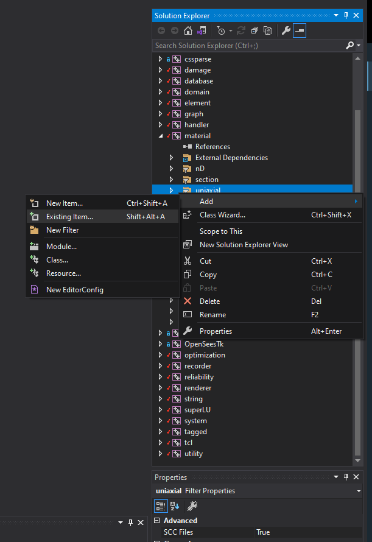
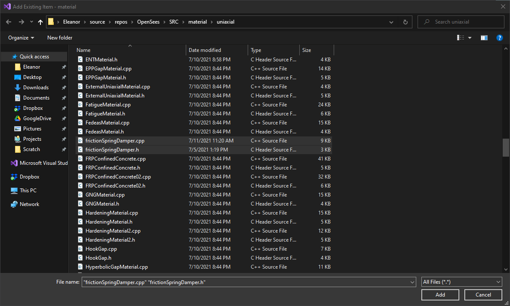

Building OpenSeesPy on Windows and adding a new uniaxial material
=================================================================


Adding the material
-------------------

- Note that any `OPS_Export` declarations should be removed, since these are
  used for "plugin" materials.
  - Similarly, I don't think `local_init` gets called by "internal" materials.
- Add `frictionSpringDamper.cpp` and `frictionSpringDamper.h` to
  `SRC/material/uniaxial/`
- Add the material's initialization function to the uniaxial material lookup in
  `SRC/interpreter/OpenSeesUniaxialMaterialCommands.cpp`:

``` diff
@@ -198,6 +198,7 @@ void *OPS_EnergyUnloadingRule();
 void *OPS_KarsanUnloadingRule();

 void* OPS_HystereticPoly(); // Salvatore Sessa 14-01-2021 Mail: salvatore.sessa2@unina.it
+void* OPS_frictionSpringDamper();

 namespace {

@@ -343,6 +344,7 @@ namespace {
        uniaxialMaterialsMap.insert(std::make_pair("IMKPeakOriented", &OPS_IMKPeakOriented));
        uniaxialMaterialsMap.insert(std::make_pair("SLModel", &OPS_SLModel));
        uniaxialMaterialsMap.insert(std::make_pair("HystereticPoly", &OPS_HystereticPoly)); // Salvatore Sessa 14-Jan-2021 Mail: salvatore.sessa2@unina.it
+       uniaxialMaterialsMap.insert(std::make_pair("frictionSpringDamper", &OPS_frictionSpringDamper));

        return 0;
     }
```

- Add the source files to the `material/uniaxial` project in Visual Studio:





Building OpenSeesPy
-------------------

1. Clone OpenSees repository, checkout latest stable(ish) tag (v3.3.0 at time of writing)
2. Open the solution (`OpenSees\Win64\OpenSees.sln`)
3. Change build from `Debug.DLL` to `Release`
4. Find the Python version OpenSeesPy expects (3.8 at time of writing):
   - OpenSeesPy → Properties → Linker → Input → Additional Dependencies → pythonXX.lib
5. Install Anaconda with Python X.X, doing one of the following:
   - Install Anaconda in `C:\Program Files\Anaconda3`
   - Point the OpenSeesPy project to your installation of Anaconda:
     - OpenSeesPy → Properties → Linker → General → Additional Library Directories → `%PATH_TO_ANACONDA%\libs`
     - OpenSeesPy → Properties → C/C++ → General → Additional Include Directories → `%PATH_TO_ANACONDA%\include`
6. Install Tcl, doing one of the following (yes you do still need it):
   - Install a Tcl distribution for Windows, such as [Magicsplat](https://www.magicsplat.com/tcl-installer/index.html) at `C:\Program Files\Tcl`
   - Point *each project that needs it* (why is this not centralized???) to where you've installed Tcl
     - $Project → Properties → Linker → General → Additional Library Directories → `%PATH_TO_TCL%\Library\lib`
     - $Project → Properties → C/C++ → General → Additional Include Directories → `%PATH_TO_TCL%\Library\include`
7. Extract any missing libraries from `OpenSeesLib.zip` into `OpenSees\Win64\lib\release` (some are already present in the repository)
8. Build the OpenSeesPy project!
9. Copy `opensees.pyd` from `OpenSees\Win64\bin\release` to your Anaconda `site-packages` directory (`%PATH_TO_ANACONDA%\lib\site-packages`) to make it importable from anywhere.
